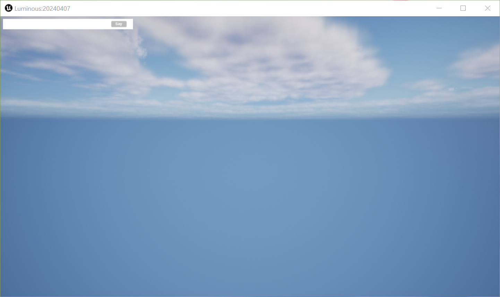
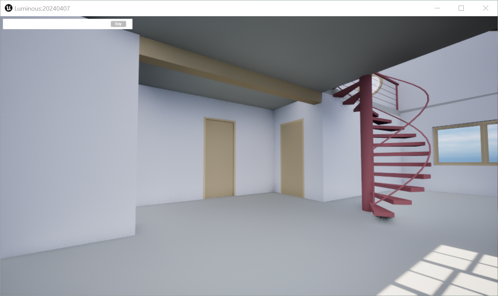
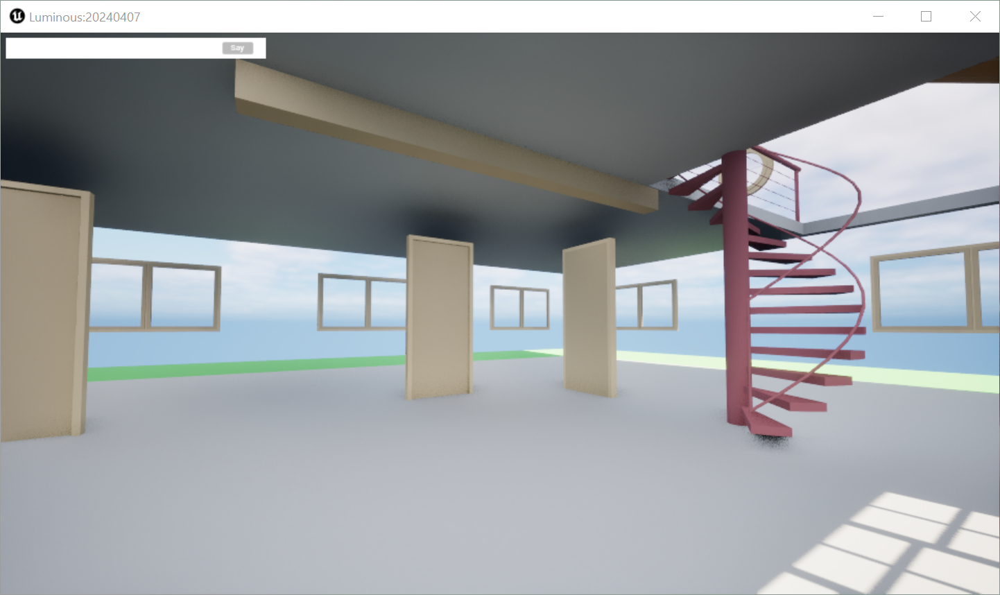

# BIM-LLM

This repository encapsulates several modules that work with BIM data (Building Information Modeling). Its functionalities include:

 * Connecting to an existing custom Unreal Engine sandbox and applying changes to the scene via a Python API.
 * Establishing a server that hosts LLMs with the ability to generate Python code from text queries to interact with the sandbox.

The proposed system is described in the paper titled "BIM-LLM: A Virtual Assistant for Architectural Design in a VR Environment". It is currently under evaluation and the current version can be found as a PDF in this repository. 

## Running the sandbox

The first thing you should do after cloniing the repository is to download the sandbox and set everything up correctly to get it running. Depending on your OS, you will download different executables, the options being [Windows](https://drive.google.com/file/d/1JxPCLwUEc7SMMcnlmJBXcaxH3iVgGZtj/view?usp=sharing) and [Linux](https://drive.google.com/file/d/1-MwG-NxYy9ccYPKLMqlLaKPm37kC9ujC/view?usp=sharing). We recommend to unzip it under src/sandbox in order to keep things under control.

For Windows users, just execute `src/sandbox/Windows/Luminous.exe` to get the sandbox running. For Linux users, open the command line and execute the Luminous.sh found in the zip file: `sh src/sandbox/Linux/Luminous.sh`.

In any case, the sandbox will be empty with no building at all in sight. This is expected, as buildings are loaded using the Python API:




## Installing dependencies

It is necessary to work with Python 3.11 or more. You are free to use Conda or Pip, but explanations focus on Pip. To install the minimum requirements to run the repository, you first need to install the dependencies found in `requirements.txt` with `pip install -r requirements.txt`.

Apart from those dependencies, you will also need to install the package `ìfcopenshell`. Unfortunately, sometines installing it via pip gives an error, so you will need to enter on this [link](https://docs.ifcopenshell.org/ifcopenshell-python/installation.html), go to the ZIP packages section, and follow the instructions there to install it manually.

Finally, in order to load .ifc files into the Sandbox, you need to download a file and locate it under 'src/luminous'. In the case of Windows devices this file will be [IfcConvert.exe](https://drive.google.com/file/d/1uC-7S6LgioBF-WLwtBklamXlc0_FAW0e/view?usp=sharing) whereas for Linux it will be [IfcConvert.elf64](https://drive.google.com/file/d/1n_rtzLPNKvLXFccLlKLprTNPdvVDLQ3p/view?usp=sharing).

## Main Scripts

There are two main scripts to be found in this repository. The first one focuses on interacting with the building in the sandbox, and the latter retrieves relevant information from a BIM (or .ifc file).

### main.py

This script is prepared to connect to the sandbox and execute code generated with LLMs. This means that there are two things to be done before running the script:

 1) Run the sandbox (as specified above).
 2) Run the VLLM server, either on your device or a server (follow the example at `scripts/vllm_server.slurm`).

To run the script, execute the following:

```
python main.py --config config.yaml 
```

The configuration is specified in config.yaml, where you can specify different input parameters. They are divided into five groups:

 * *voiceLayer*: you can specify the api URL and key, along an input argument that controls whether partial audios are transcribed or not. 
 * *sandbox*: you can specify the IFC file to be loaded in the sandbox and the IP address and port in which the sandbox is listening (127.0.0.1:9999 by default).
 * *helperLLM*: when using a VLLM server, you will need to specify the model name and the API's URL and key to connect to that specific LLM (which are set when initializing the server). In case of using Google's gemini, set `isGoogle` to `true`.

For this script, the *voiceLayer* is optional. However, you don't need to remove its content in the config file if you are not using it.

Once it is executed, you will be prompted to give an instruction. For example, given "Hide all walls in sight", the scene in the sandbox would change in the following manner:




If you enter an empty string, the voice layer will be activated, your microphone will record during 5 seconds whatever you say and it's going to transcribe it via the voice layer. However, you need a server with a valid key to use it. Moreover, a second inference by the LLM is done to give a verbal feedback to the user. If the sandbox is focused just after the execution of the code, you will hear it as an audio.

**Note:**: The code is prepared for a private WSS server that is not provided, so minor changes might be needed to adapt the code to another WSS server. Changes should be made in `src/voice_layer.py`.

### evaluation.py

This script makes is the one used for the human evaluation of our paper. The dataset can be found in `data/eval/evaluation_dataset.tsv`, and once annotated with the following script, it will save its annotated version in another .tsv file.

```
python evaluation.py \\
   --config config.yaml \\
   --in_path data/eval/evaluation_dataset.tsv \\
   --out_path data/eval/annotated_evaluation_dataset.tsv
```

## Python API

The Sandbox script is prepared to generate Python code that follows a custom API. You won't need to write the code itself, but it is good to have a general gist. You can find it inside `src/luminous`.

The connection with the sandbox is done with the following code. 

```
from src.luminous.luminous import Luminous

l = Luminous()
```

In order to load a building into the scene, and IFC object is loaded:

```
from src.luminous.luminous_ifc import IFC

ifc = IFC(l.load_ifc(ifc_filename))
```

When the LLM generates the code, it takes these variables into account, as if `l` and `ifc` were already instantiated. You can play with the functions found in the API freely. You can check `src/prompting/sandbox_prompts.py` for the documentation (`API_DOCS`) and a few examples (`API_EXAMPLES`).


